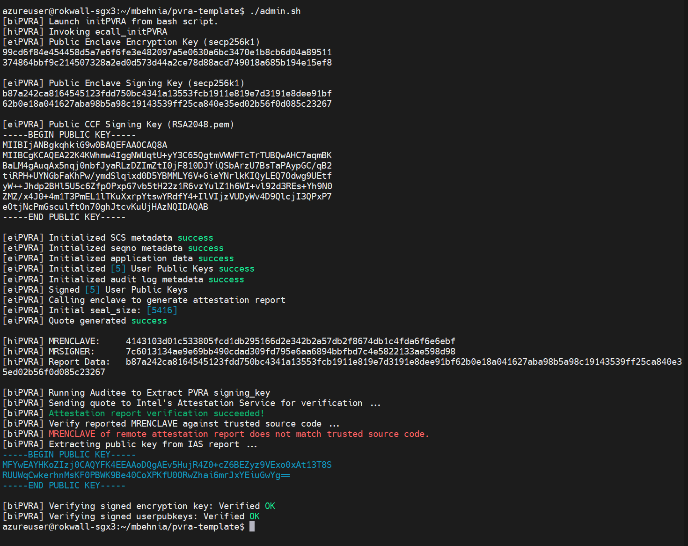
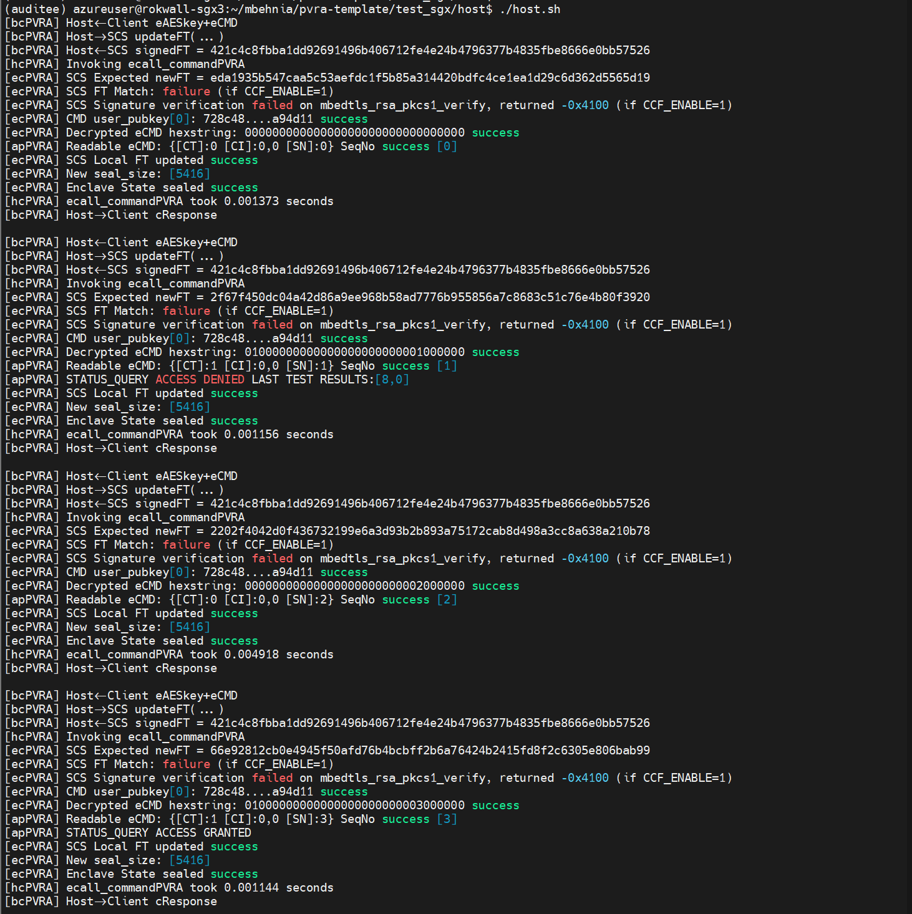
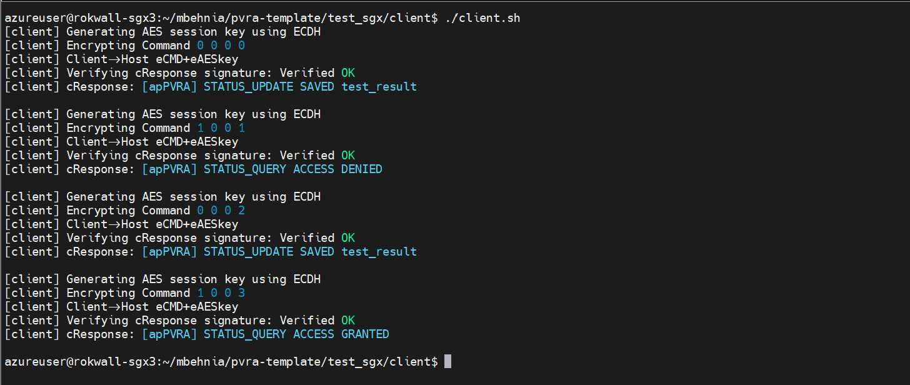

# PVRA Template

To browse the trace of a PVRA application look under ```./applications/``` for the sample applications. VSC currently at 153 LoC and HeatMap at 171 LoC.

How to write a PVRA application:

Make new directory under ```./applications/``` named after your application
Edit appPVRA.h and appPVRA.c based on application functionality
Edit host.sh and client.sh based on host/client behavior model
Edit executables ./format_command and ./encrypt_command for client->host BB bypass
Upload all files to same application directory


How to compile and run a PVRA application:

In order to run an existing application pass the APP_NAME to ./setup.sh script


```
Terminal 1:
./setup.sh -a|--app <APP_NAME> -c|--ccf <CCF_PATH>
make
export SGX_SPID=<SGX_SPID>
export IAS_PRIMARY_KEY=<IAS_PRIMARY_KEY>
./admin.sh

cd ./test_sgx/host
./host.sh

Terminal 2:
cd ./test_sgx/client
./client.sh
```
NOTE: setup.sh with no arguments uses VSC application and sources my local CCF directory (assuming CCF is running which it usually is)
NOTE: setup.sh --clean to undo effects of the script
NOTE: CCF_pubkey is hardcoded in enclave image as a root of trust, this must be updated in enclave/initPVRA.c to reflect the live CCF pubkey

\[TODO\]\[AUDITEE\]: admin.sh sources a python venv for auditee, give instructions on how to setup that python environment and isolate that from admin.sh script
\[TODO\]\[AUDITEE\]: MRENCLAVE MATCH FROM DOCKER BUILD

\[TODO\]\[ACCESSIBILITY\]: make available ./debug/aes/encrypt.c and ./debug/aes/format.c for generation of ```encrypt_command``` and ```format_command``` executables OR EVEN BETTER, MAKE these files completely seamless and adaptive to struct clientCommand 

Sample VSC Run:








